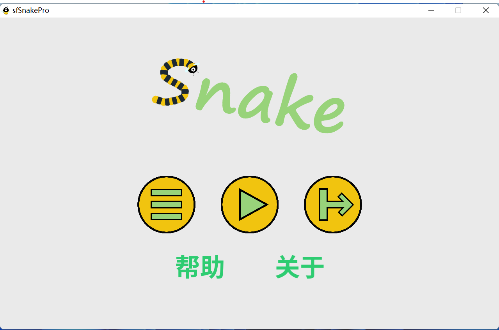
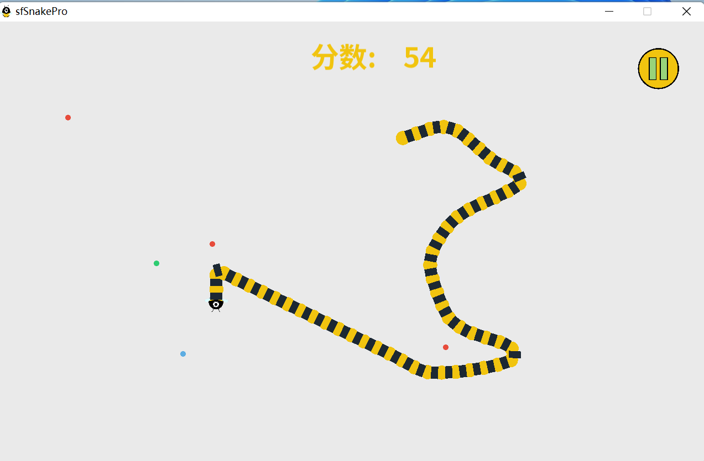

<h1 align="center"> sfSnakePro </h1>

---

## 程序介绍

这是2022年春季复旦大学面向对象程序设计课程大作业

基于SFML图形库的贪吃蛇小游戏

原版代码作者 [jhpy1024](https://github.com/jhpy1024/sfSnake)

[查看修改日志](doc/ChangeLog.md)

[查看设计说明](doc/贪吃蛇游戏设计说明.md)

## 编译环境的说明

- Windows 11 专业版
- GCC 11.2.0
- MinGW-w64 9.0.0 (linked with msvcrt)
- GNU Make 4.3
- SFML 2.5.1
- 全部 static 编译

## 特点

相比原版和大部分走直线的贪吃蛇，界面直白简单，动画丝滑流畅，操作易上手

## 操作

点击或长按任意位置，变化蛇的方向

按w/a/s/d或者上/下/左/右键转向

蛇到边界的时候会从对称一边出来

按住空格可以加速

## 截图

## 下载

Release下载之后解压就可以了

## license

The MIT License (MIT)
Copyright © 2022 <JingYiJun>

Permission is hereby granted, free of charge, to any person obtaining a copy of this software and associated documentation files (the “Software”), to deal in the Software without restriction, including without limitation the rights to use, copy, modify, merge, publish, distribute, sublicense, and/or sell copies of the Software, and to permit persons to whom the Software is furnished to do so, subject to the following conditions:

The above copyright notice and this permission notice shall be included in all copies or substantial portions of the Software.

THE SOFTWARE IS PROVIDED “AS IS”, WITHOUT WARRANTY OF ANY KIND, EXPRESS OR IMPLIED, INCLUDING BUT NOT LIMITED TO THE WARRANTIES OF MERCHANTABILITY, FITNESS FOR A PARTICULAR PURPOSE AND NONINFRINGEMENT. IN NO EVENT SHALL THE AUTHORS OR COPYRIGHT HOLDERS BE LIABLE FOR ANY CLAIM, DAMAGES OR OTHER LIABILITY, WHETHER IN AN ACTION OF CONTRACT, TORT OR OTHERWISE, ARISING FROM, OUT OF OR IN CONNECTION WITH THE SOFTWARE OR THE USE OR OTHER DEALINGS IN THE SOFTWARE.