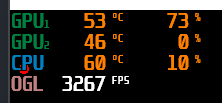
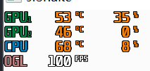

<!-- 
this change log is to log the difference from origin sfSnake on https://github.com/jhpy1024/sfSnake.git
-->

# change log

## 20220508

1. modify `void GameScreen::generateFruit()` in `GameScreen.cpp`
```c++
// GameScreen.cpp
- static std::default_random_engine engine;
- engine.seed(time(NULL));
+ static std::default_random_engine engine(time(NULL));
```
修复了水果生成为同一行的bug

2. modify `Snake::Snake()` in `Snake.cpp`
```c++
// Snake.cpp
- pickupBuffer_.loadFromFile("Sounds/pickup.aiff");
+ pickupBuffer_.loadFromFile("Sounds/pickup.wav");
```
修复了拾取水果后无音效的bug
需要将"Sounds/pickup.aiff"转码为"Sounds/pickup.wav"

> `// InputSoundFile.hpp`
> The supported audio formats are: WAV (PCM only), OGG/Vorbis, FLAC.
> The supported sample sizes for FLAC and WAV are 8, 16, 24 and 32 bit.

3. modify `Snake::Snake()` in `Snake.cpp`
```c++
// Snake.cpp
- Snake::Snake() : direction_(Direction::Up), hitSelf_(false)
+ Snake::Snake() : hitSelf_(false), direction_(Direction::Up)
```
修改了构造函数初始化表的顺序为`Snake`类中声明的顺序

4. modify `GameOverScreen::GameOverScreen(std::size_t score)` in `GameOverScreen.cpp`

```c++ 
// GameOverScreen.cpp
- text_.setColor(sf::Color::Red);
+ text_.setFillColor(sf::Color::Red);
```

5. modify `MenuScreen::MenuScreen()` in `MenuScreen.cpp`
```c++ 
// MenuScreen.cpp
- snakeText_.setColor(sf::Color::Green);
+ snakeText_.setFillColor(sf::Color::Green);
```
将已弃用(deprecated)的`setColor`方法更改为建议使用的`setFillColor`方法

## 20220520

1. 大幅修改 `Snake` 类的实现。(70%)
    1. 节点
    现在 `Snake` 类不依赖于 `SnakeNode` 类，不使用 `vector` 而使用 `deque` 作为蛇路径的容器，
    头结点（0号节点）作为蛇头节点，之后第 $10k (k = 1, 2, ... , n)$ 个节点是蛇身体节点，
    使用黄色，半径为 $r$ 的圆作为节点的形状
    第 $5(2k+1) (k = 1, 2, ... , n)$ 个节点是蛇的关节节点，使用 $r \times \sqrt{3}r$ 的矩形作为形状。
    矩形法线方向为 后一节点->前一节点 的方向。
    2. 更新
    每次更新时，`push_front` 一个头结点+方向向量的节点
    同时判断尾结点的重叠次数(overlap)，若重叠次数为零，则 `pop_back` 尾结点
    每次只加入一个path节点，而将固定帧率提高到100fps，操作和视觉效果更加流畅、丝滑。
    3. 性能方面
    相比于 `vector` 每次更新时要全部移动一位，`deque` 只需要改变头尾节点，处理更高效。
    尤其在容器的 `size()` 很大的时候，有非常显著的性能提升。

2. `Game.cpp` 的更改
    1. `render()` 函数放在while中，将帧数从 3000+fps 降至固定的 100fps, 减少不必要的性能浪费
    GPU占用率从73%降到35%
    原版：
    
    改版：
    
    2. 使用 `sf::VideoMode::getDesktopMode()` 函数获取当前桌面分辨率，将窗口大小设定为当前窗口分辨率的一半，以适配不同适配分辨率的机器，后续可能会增加全屏模式。
    3. 类的静态中成员增加了作为游戏全局设置的变量

3. 字体改动
   修改全局字体为 SourceHanSansSC-Bold.otf 思源黑体，支持中文显示

4. 文件树优化
   所有源文件归类到src文件夹，其他资源归类到assets文件夹，分好类。便于查看

5. makefile的优化
   使用static编译，让最终的程序方便分发。

## 20220520

1. `Fruit` 的更改
    1. 将 `Fruit` 类修改为struct，因为没有什么值得私有的成员变量
    2. `GameScreen` 类中，`fruit` 的存储由 `vector` 改为 `deque`，删除一个水果的效率提高了。
    3. 新增5种水果颜色显示，用 `score` 存储每种水果的得分。
    4. 修改了随机生成水果的函数，现在可以按照要求生成五种水果了。（黑色加棕色 25%，红色、蓝色、绿色各25%）

2. 网格的实现和拓展
    1. 在 `Grid.h` 和 `Grid.cpp` 中声明并实现了网格类和网格的渲染
    2. ~~实现了按G键切换开启、关闭网格状态~~

## 20220524

1. 新增游戏玩法
    1. 按空格键加速
    2. 鼠标点击控制方向，长按拖拽可以持续控制方向
    3. ~~新增手柄操作控制方向~~

2. UI优化，新增自己画的主题title `logo.png`，并且设计了UI交互逻辑

## 20220525

1. 增加了 `OptionScreen`, 现在可以在`OptionScreen`里面切换颜色状态了
   1. `optionScreen`使用`OptionButton`进行设置
   2. 鼠标移动到选项上会有下划线的显示
   3. 鼠标点击之后颜色改变，同时有全局网格和颜色反馈
2. 小幅度优化了UI设计，新增返回UI和重置UI
3. 设计了键盘锁和鼠标锁，防止误触

## 20220526

1. 删除手柄控制和键盘控制窗口切换
2. 全面统一UI设计，通过`Button`类操作并显示
3. 增加 `PauseScreen` 类，在游戏中暂停可以进入暂停界面，可以进行设置、重新开始、退出、返回等操作
4. 游戏中实时显示分数

## 20220527

1. 新增帮助界面和关于界面, `HelpScreen` 和 `AboutScreen`
2. 在首页，暂停页，结束页添加帮助按钮和关于按钮
3. 将 `OptionButton` 类独立出来，方便复用
4. 到这里就不做大的改动了，整体定型

## 20220529

1. 将 `TitleSprite` 类独立出来，便于代码复用
2. 统一了变量命名规范，增加了一些注释
3. 同时修复了都含有 `TitleSprite` 的界面切换时角度不统一的问题。修改之后，`TitleSprite` 作为全局元素渲染和更新
4. 将水果颜色的定义移动到 `Game.cpp`
5. 新增首次游戏前先跳转到帮助界面的功能

## 20220530

1. 修改了 bgm
2. 继续写设计说明文档和 `README.txt` 